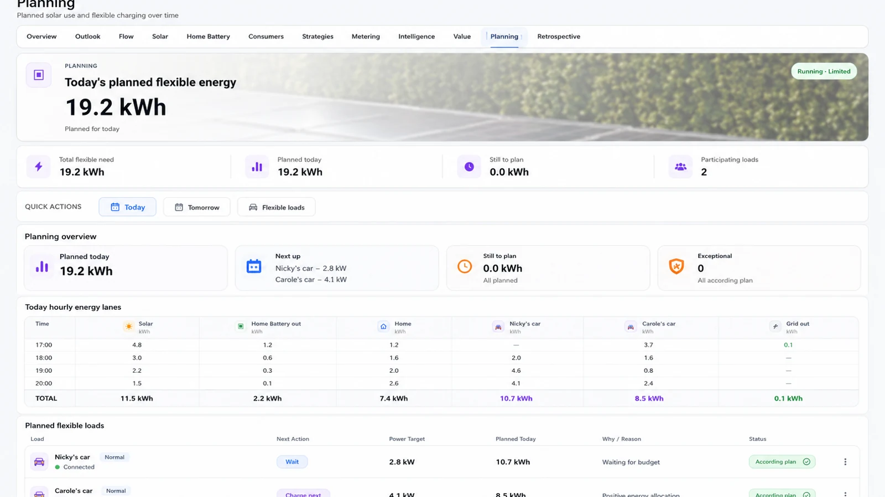

# Robotix Home Intelligence Energy UX



Public GPL-3.0-only Home Assistant dashboard package for **Robotix Home Intelligence Energy**.

- UX release: see `package.json` (authoritative)
- Contract/backend/stage/rollback context: see `release/product.json` (authoritative)
- HACS category: **Dashboard**
- Runtime artifact: `dist/rhi-energy-ux.js`

The backend owns Energy semantics. The UX renders backend-owned public contracts and never invents the backend version.

Company branding is owned by RHI UX Core and bundled from the pinned Core snapshot; Energy does not maintain a second branding authority. Energy asset packaging is limited to domain-specific imagery. Runtime code must not redraw, recolour, filter or synthesize the company mark.

## Install with HACS

### First-time install

1. Open **HACS** → **Custom repositories**.
2. Add `https://github.com/npinguin/rhi-energy-ux`.
3. Select **Dashboard**.
4. Install the intended published TEST CANDIDATE version shown in GitHub Releases / HACS.
5. Go to **Settings → Dashboards → Resources**.
6. Confirm this resource exists as **JavaScript Module**:

```text
/hacsfiles/rhi-energy-ux/rhi-energy-ux.js
```

Do not manually copy JavaScript or artwork to `/config/www` for a normal HACS install.

### Migrate from the old manual Energy UX

When the HACS resource above is present, remove the old active resource such as:

```text
/local/homebrain/cards/homebrain-energy.bundle.js?v=...
```

Do **not** load the old and HACS bundles at the same time.

Keep the old files on disk until the HACS runtime has been verified on the target Home Assistant instance.

## Copy-paste dashboard YAML

The Home Assistant **dashboard URL is your deployment choice**. The Energy UX does not depend on a fixed dashboard root. You can use `robotix-energy`, `energy`, or another URL.

For a dedicated Energy dashboard, **Edit dashboard → Raw configuration editor** must contain a top-level `views:` array:

```yaml
views:
  - title: Energy
    path: overview
    icon: mdi:flash
    type: panel
    cards:
      - type: custom:homebrain-energy-card
```

The example view path `overview` is not a runtime dependency. If Home Assistant uses a generated view path such as `0`, the card must work there as well. Energy capability navigation stays inside the card and never assumes or rewrites the Lovelace dashboard root.

If your existing dashboard already has its own view/layout or URL, keep it and use only this card declaration where the Energy card belongs:

```yaml
type: custom:homebrain-energy-card
```

No `dashboard_path` setting is required for the normal Energy installation. HACS resources and package artwork remain under the absolute `/hacsfiles/rhi-energy-ux/...` path independently of the dashboard URL.

### Important: do not paste resource YAML into the dashboard editor

This is **not** dashboard YAML:

```yaml
lovelace:
  resources:
    - url: /hacsfiles/rhi-energy-ux/rhi-energy-ux.js
      type: module
```

Use that block only in `configuration.yaml` on installations that explicitly manage Lovelace resources in YAML. Most HACS installations should let HACS manage the resource.

If Home Assistant reports **"views -- Expected an array"**, you pasted resource configuration into the dashboard editor. Replace it with the `views:` example above.

## Runtime verification

After install or update:

1. Hard-refresh the Home Assistant frontend.
2. Open Energy under the dashboard URL you chose (for example `/robotix-energy/0`) and verify the card renders.
3. Verify Overview → Flow → Solar → Home Battery → Consumers → Gas and the Intelligence/Insights tabs without leaving that dashboard root.
4. Refresh the browser on that custom dashboard URL and verify the card still renders.
5. Verify desktop and iPad.
6. Confirm only the HACS Energy UX resource is active.
7. Check the footer:
   - healthy: quiet gray `RHI Energy UX <version> · Backend <version>`;
   - problem: the short issue summary becomes amber/red;
   - click `issues · details` to expand the concrete runtime/backend conditions and verification guidance.
8. Only after this proof, remove obsolete files under `/config/www/homebrain/...`.

The backend version comes only from `sensor.energy_release_contract.backend_release`. If that value is wrong, fix the backend release contract; the UX must not map or guess it.

## Update and rollback

Published GitHub releases are immutable. TEST CANDIDATE releases are normal GitHub Releases so HACS exposes them without enabling beta/prerelease versions; qualification status is tracked separately.

To rollback:

**HACS → Robotix Home Intelligence Energy UX → Redownload / Need a different version? → select the previous release.**

Use the candidate and rollback versions recorded in `package.json`, `release/product.json` and GitHub Releases; do not treat this README as release identity.

## Development

```text
npm ci
npm run validate
```

A candidate is valid only when the PR validation is green, the deterministic second build matches the first, committed `dist/` matches that build, and HACS validation passes. Publication then tags those exact committed package bytes without rebuilding.

See `BUILDING.md`, `docs/CONTRACT.md`, `docs/BRANDING.md`, `docs/TEST_GOVERNANCE.md`, `validation/OWNERSHIP.json`, `docs/UX_RELEASE_STANDARD.md`, `docs/UX_FOOTER_STANDARD.md` and `docs/RELEASE_GOVERNANCE.md`.

## Source and package structure

`src/OWNERSHIP.json` and `src/manifest.json` define source ownership and build insertion order. Canonical assets live only under `src/assets/<category>/`; the build mirrors that tree under `dist/assets/<category>/`. `dist/PACKAGE_MANIFEST.json` inventories the complete generated HACS package.

For nested assets the GitHub Release intentionally does not attach `rhi-energy-ux.js`; HACS therefore installs the immutable tag's complete `dist/` subtree instead of switching to single-file mode. See `docs/SOURCE_PACKAGE_GOVERNANCE.md`.
